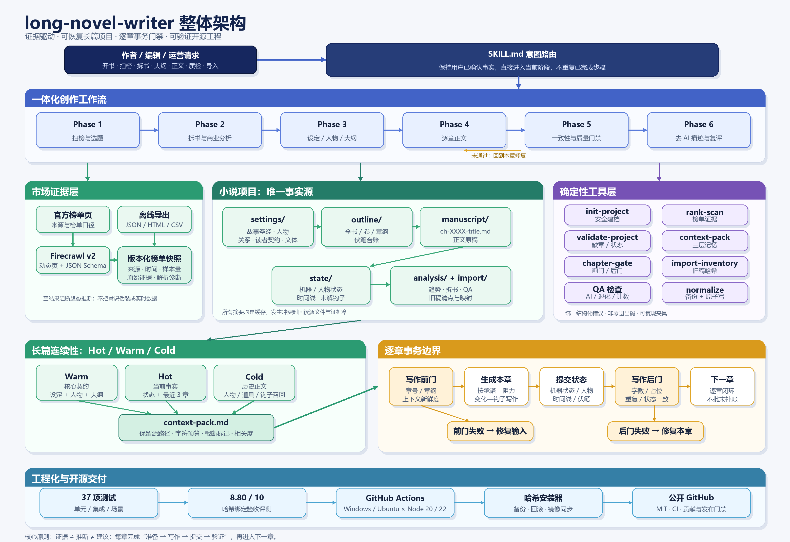

# long-novel-writer

[](https://github.com/Da-loong/long-novel-writer/actions/workflows/ci.yml)

面向中文长篇网络小说的 Codex/Agent Skill。目标不是“一键声称写完百万字”，而是把开书、拆书、设定、大纲、正文、连续性、质检、榜单证据和旧稿导入做成可验证工程。

公开仓库：https://github.com/Da-loong/long-novel-writer

## 当前状态

- 版本：`0.3.0-rc.1`
- 初始基线：`7.5/10`
- 当前仓库评测：`8.67/10`（69 项自动测试通过，并包含一次三读者前三章盲读前向运行）
- 发布门槛：任务级加权评测 `>= 8.5/10`，且无 P0、P1 未关闭问题
- 支持环境：Windows、Linux；Node.js 20+
- GitHub：公开仓库已建立；以 `main` 分支 CI 和发布门禁作为合并基线

本仓库不会用文件数量、README 声明或单一绿色测试证明“生产可用”。能力必须同时具备实现、失败语义、测试夹具和任务级证据。`8.67` 是仓库验收量表结果，不是对任意题材、任意百万字成稿质量的保证；新鲜盲读已覆盖前三章，当前公开保留的 P2 项是异能规则边界和第三章因果密度。

## 已实现能力

- 从开书、读者契约、人物/世界规则、大纲到逐章正文的统一路由。
- 32 类差异化题材卡，每张包含长篇循环、黄金三章、升级刻度、状态字段和失误预警。
- 项目初始化、状态校验、Hot/Warm/Cold 上下文打包、章节事务、Canon 哈希锁、写作前门与落盘后门。
- JSON、JSONL、HTML table、CSV/TSV/pipe 榜单导入；Firecrawl v2 结构化抓取、请求预览、原始证据和空结果阻断。
- 旧稿哈希清点、章节标题映射、缺章/重复章/编码损坏诊断。
- AI 套路线索、退化/占位/重复检测、字符统计和带备份的原子标点规范化。

## 整体架构



可编辑 Mermaid 源文件：[`docs/architecture-overview.mmd`](docs/architecture-overview.mmd)

## 仓库结构

```text
skill/long-novel-writer/   可安装技能本体
tests/                     单元与集成测试
evals/                     任务级评测规范与证据
tools/                     仓库验证、安装和评测工具
research/                  上游研究与许可证边界
.github/workflows/         跨平台 CI
```

## 本地验证

```powershell
npm run verify
```

该命令依次执行 JavaScript 语法检查、技能结构检查、单元/集成测试和可复现评测。

发布门禁比普通验证更严格：

```powershell
npm run release:check
```

## 安装

先验证，再执行带哈希核对、旧版备份与失败回滚的安装：

```powershell
npm run install:skill
# 或同步到显式目录
node tools/sync-install.mjs --target D:\path\to\skills\long-novel-writer
```

默认目标为 `~/.codex/skills/long-novel-writer`。替换前的版本保留为同级时间戳备份目录。

## 快速使用

```powershell
$skill = "<仓库>\skill\long-novel-writer"

# 新建小说工程
node "$skill\scripts\init-project.js" --root . --title "雾港来信" --genre "悬疑" --target-words 800000

# 扫榜：先 dry-run 核对请求，不消耗 Firecrawl 额度
node "$skill\scripts\rank-scan.js" --platform fanqie --dry-run

# 逐章事务：begin 自动打包上下文并过前门；写作和状态提交后由 finish 验收
node "$skill\scripts\chapter-transaction.js" begin .\雾港来信 --chapter 1 --query "林舟 账本" --min-chars 2500 --max-chars 3500
node "$skill\scripts\chapter-transaction.js" finish .\雾港来信 --chapter 1
```

## 已知限制

- Firecrawl 云端实时扫榜需要本地配置 `FIRECRAWL_API_KEY`；自部署实例可配置 `FIRECRAWL_API_URL`。
- 没有凭证时只执行请求预览与离线导入测试，不伪造实时榜单结果。
- 调研样本包含 AGPL 与许可证未声明项目；本仓库只提炼架构机制，不复制其代码或文本。
- 平台 DOM 会变化；CI 使用固定夹具和本地 Firecrawl mock，不消耗云端额度，也不声称持续监控线上榜单。
- `ciweimao` 的稳定官方榜单入口尚未核验，必须显式传入 URL。
- 已记录独立新 Agent 的前三章盲读：`evals/field-tests/2026-08-08-forward-panel.md`；三名读者均选择继续，综合 readerExperience=8.0。

## 许可证

MIT。第三方项目及服务保持各自许可证与使用条款。

## Durable unattended run

A one-start execution is available through the bundled bridge. It records every Agent prompt/transcript and resumes from the last committed chapter:

```powershell
node "$skill\scripts\autopilot-runner.js" start .\BOOK
node "$skill\scripts\autopilot-runner.js" run .\BOOK --model "MODEL" --quiet
node "$skill\scripts\autopilot-runner.js" status .\BOOK
```

Use `--max-chapters N` for a bounded test slice. The runner pauses at the three-chapter cold-reader gate, retries bounded failures, and stores evidence under the book directory.

## Fanqie mobile manuscript format

Each chapter is checked by `scripts/format-gate.js` before commit. The gate keeps one chapter title, single blank lines, short mobile-first paragraphs, purposeful standalone dialogue, and plain publishable prose. Markdown tables/lists/code fences, outline headings, crowded paragraphs, repeated timeline openers, and low-action subject chains are recorded as format findings; hard findings send the current chapter back to rewrite and are preserved in `analysis/autopilot-qa-chXXXX.json`.

```powershell
node "$skill\scripts\format-gate.js" .\BOOK\manuscript --json
```
